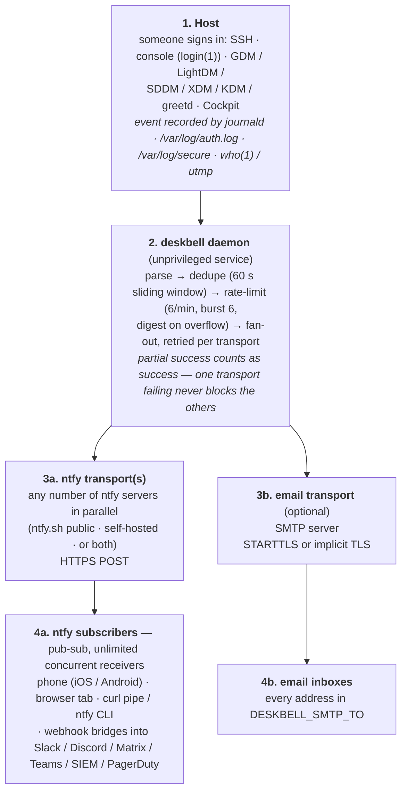

<p align="center">
  
</p>

# deskbell — notifies you when anyone logs in to Linux

You have Linux machines. You want to know when someone logs in.

deskbell runs on a Linux machine and sends you a notification when someone
signs in. It detects SSH, console, display-manager (GDM, LightDM, SDDM,
XDM, KDM, greetd), and Cockpit logins, and fans every notification out to
any number of [ntfy](https://ntfy.sh) destinations (public ntfy.sh,
self-hosted, or a mix) and/or email — in parallel, with retries. Single Go
binary, self-installing hardened systemd service, no broker, no agent.

---

## Table of contents

- [What it detects](#what-it-detects)
- [How it works](#how-it-works)
- [Receiving notifications](#receiving-notifications)
  - [Email](#email)
  - [ntfy](#ntfy)
    - [iOS — important: make notifications persistent](#ios--important-make-notifications-persistent)
    - [Android — usually works out of the box](#android--usually-works-out-of-the-box)
- [Install](#install)
  - [Get the binary](#get-the-binary)
  - [systemd (self-install)](#systemd-self-install)
  - [OpenRC](#openrc)
  - [runit](#runit)
  - [s6 / s6-rc](#s6--s6-rc)
  - [supervisord](#supervisord)
  - [Run it directly (no supervisor)](#run-it-directly-no-supervisor)
- [Configuration](#configuration)
  - [Command-line flags](#command-line-flags)
  - [Environment variables](#environment-variables)
  - [Multiple ntfy destinations](#multiple-ntfy-destinations)
  - [Email (SMTP)](#email-smtp)
- [Verifying delivery: `deskbell check`](#verifying-delivery-deskbell-check)
- [Startup ping](#startup-ping)
- [Operating](#operating)
- [Uninstall](#uninstall)
- [Privileges](#privileges)
- [Security model](#security-model)
- [Build, test, lint](#build-test-lint)
- [Project layout](#project-layout)
- [Troubleshooting](#troubleshooting)

---

## What it detects

deskbell detects **any ordinary user signing in to the host** —
interactively, regardless of method. It does this by checking and
monitoring several independent information sources that Linux already
maintains: the systemd journal (`journalctl`), traditional auth log
files (`/var/log/auth.log`, `/var/log/secure`), and the live session
table (`who(1)` / `utmp`). All sources run in parallel and a deduper
makes sure each login is reported once, even when two sources see it.

The interactive sign-in paths it covers:

| Login type            | Detected via                                                                |
|-----------------------|-----------------------------------------------------------------------------|
| SSH (any auth method) | `sshd: Accepted <method> for <user> from <ip> port <port>`                  |
| Console / TTY         | `util-linux login(1)` syslog: `LOGIN ON ttyN BY <user>` and `ROOT LOGIN ON` |
| Display managers      | PAM `session opened` for gdm-password, lightdm, sddm, xdm, kdm, greetd      |
| Cockpit (web admin)   | PAM `session opened` for the cockpit service                                |
| Live SSH/console      | `who(1)` snapshot polled at the configured interval (fallback only)         |

Events that are explicitly **not** notified:

- Failed login attempts (out of scope; use fail2ban, sshguard, or auditd).
- Privilege transitions (`su`, `sudo`).
- Service-account sessions (`cron`, `systemd-user`, `polkit`, `runuser`, `at`).
- Authentication that does not result in a session (port-knocking, key probes).

## How it works

Read top to bottom as four numbered stages. Stage 3 splits into two
parallel paths — ntfy and email — because deskbell publishes every
notification to every configured transport at the same time.



The four numbered stages in detail:

1. **Host.** deskbell consumes login events from whichever of these is
   available. All three sources run concurrently — the first to produce
   an event wins, and the deduper drops the rest:
   - `journalctl -f -o json` (preferred; sub-second latency).
   - Tail of `/var/log/auth.log` or `/var/log/secure` (for hosts without
     systemd, or where `journalctl` is restricted).
   - Polled `who(1)` snapshots every `-poll` seconds (last-resort fallback;
     also catches purely TTY-based logins on minimal systems).

2. **Daemon pipeline.** Inside deskbell, every event flows through:
   - **Parser** — regex-based extraction of user, source IP, port, TTY,
     and auth method from the raw log line.
   - **Deduper** — 60 s sliding window keyed by `user + origin + tty +
     method` so the same login surfacing in journal *and* `who(1)` only
     fires once.
   - **Rate limiter** — token bucket: 1 token per 10 s, burst of 6.
     Bursts above that are queued (cap 1000) and **coalesced into a single
     digest notification** at the next 60 s tick — useful when a brute
     attempt floods auth.log, since you get one summary instead of
     hundreds of pings.
   - **Fan-out dispatcher** — sends each notification to every configured
     transport *in parallel*. One slow or failing transport does not
     block the others; partial success counts as success.

3. **Transports.** Each transport speaks its own protocol and runs its
   own retry loop (3 attempts, jittered exponential backoff: 500 ms
   initial, 10 s cap). Permanent errors (4xx from ntfy, SMTP auth
   rejection, malformed STARTTLS) skip the retry wait. Configured via
   `DESKBELL_NTFY_DESTINATIONS` and the `DESKBELL_SMTP_*` env vars — see
   [Configuration](#configuration).

4. **Subscribers.** ntfy is pub-sub: every subscriber to the topic
   receives every message. You can attach as many concurrent subscribers
   as you want — see [Receiving notifications](#receiving-notifications).

## Receiving notifications

deskbell can deliver login alerts via two independent transports — pick
one, the other, or both. When both are configured, every notification
fans out to every destination in parallel; one failing does not block
the others.

| Transport | Receiver-side setup | Configure deskbell to send |
|---|---|---|
| **email** (SMTP) | None beyond a working email account — alerts arrive in your inbox like any other message. See [Email](#email) below. | [Configuration → Email (SMTP)](#email-smtp) |
| **[ntfy](https://ntfy.sh)** (HTTP pub-sub) | Subscribe to a topic from any number of devices simultaneously: phone app, browser tab, curl pipe, webhook bridge, another ntfy server. See [ntfy](#ntfy) below. | [Configuration → Multiple ntfy destinations](#multiple-ntfy-destinations) |

### Email

Email needs no receiver-side software beyond a working email account.
Once you've set the [`DESKBELL_SMTP_*` env vars](#email-smtp) on the
deskbell host, every login event arrives at every address in
`DESKBELL_SMTP_TO` as a plain UTF-8 message. Use whatever email client
you already have — Gmail, Outlook, mutt, your phone's built-in mail app,
a server-side filter into a folder.

**Trade-offs vs. ntfy:**

- **Pros:** works everywhere, persists in your inbox forever, easy to
  archive / filter / search / forward / trigger downstream rules.
- **Cons:** typical end-to-end latency is 1–10 s (SMTP delivery, possibly
  a spam-filter hop) versus sub-second for ntfy. Push to phones uses
  your inbox provider's app rather than a dedicated channel. Harder to
  silence outside business hours without extra rules at the receiver.

Subject lines are scrubbed of CR/LF before being placed in the message
header, so a maliciously-crafted login event cannot inject a `Bcc:` or
`Reply-To:`.

### ntfy

[ntfy](https://ntfy.sh) is a free, open-source, HTTP-based pub-sub
notification service. It lets you push a message to a server with a
`curl`-shaped HTTP request and receive it on any number of subscribed
devices. Source code, self-hosting docs, and the maintained Android /
iOS apps live at **https://github.com/binwiederhier/ntfy** (Apache-2.0).

You can use the public hosted server at `ntfy.sh` (deskbell's default) or
run your own (point deskbell at it with `DESKBELL_NTFY_URL=…`).
[Configuration → Multiple ntfy destinations](#multiple-ntfy-destinations)
documents the sender-side env vars; the rest of this subsection covers
how to *subscribe* on the receiver side.

To receive deskbell's notifications, **subscribe to the topic** that
deskbell is publishing to. The topic name *is* the secret on the public
ntfy.sh server — anyone who knows it can read your alerts and post into
your feed — so make it long and random (deskbell generates one for you
when the install command sees `DESKBELL_NTFY_TOPIC` already set;
otherwise pick your own ≥ 16 random characters from `[A-Za-z0-9_-]`).

#### One topic, as many subscribers as you want

ntfy is a pub-sub service: **every subscriber to a topic receives every
message published to it.** You can — and should — subscribe to your
deskbell topic from as many places as suits you, simultaneously. They
are independent, free, and don't conflict:

- a phone (iOS or Android) for push notifications when you're away from
  your desk
- a browser tab on your laptop for live in-flight monitoring
- a `curl … /json` pipe into a terminal for scripted monitoring or audit
  logging
- a webhook bridge into Slack / Discord / Matrix / IFTTT / a SIEM (ntfy
  supports outbound webhooks server-side)
- another ntfy server forwarding via the federation features

The same login event will arrive at all of them within seconds.

You can also have **multiple deskbell hosts publish to the same topic** —
useful for whole-fleet "doorbell" channels. Or, if you'd rather keep
each host's events separate, give each host its own topic and subscribe
the phone app to several topics at once (the app shows them as separate
inboxes).

The rest of this section covers the most common subscriber types. Pick
any combination — or all of them.

#### Browser (no install, fastest to try)

Open `https://ntfy.sh/<your-topic>` in any browser — messages stream live.
Useful for quick verification right after `deskbell install`.

#### Phone apps

| Platform                | Where                                                                           |
|-------------------------|---------------------------------------------------------------------------------|
| iOS                     | App Store: search **"ntfy"** (publisher: Philipp Heckel), or follow the App Store link from https://ntfy.sh |
| Android (Google Play)   | https://play.google.com/store/apps/details?id=io.heckel.ntfy                    |
| Android (F-Droid)       | https://f-droid.org/packages/io.heckel.ntfy/                                    |

After installing, open the app, tap the **+** button, leave the server as
`ntfy.sh` (or set your self-hosted URL), and paste the topic. You can
add multiple topics to one app and toggle each on/off independently.

#### CLI / desktop / scripts

```sh
# stream as JSON, one line per message — pipe into anything
curl -s https://ntfy.sh/<your-topic>/json

# the official ntfy CLI
ntfy subscribe <your-topic>

# example: persist every alert into a local logfile
curl -s https://ntfy.sh/<your-topic>/json >> ~/deskbell-alerts.log &
```

There are also browser extensions and desktop builds linked from the
[ntfy GitHub repo](https://github.com/binwiederhier/ntfy).

#### Bridges to other services

ntfy supports outbound webhooks server-side, which means you can chain
deskbell → ntfy → Slack / Discord / Matrix / Microsoft Teams / a SIEM /
PagerDuty / anything that accepts an HTTP POST. See
[ntfy's publishing & forwarding docs](https://docs.ntfy.sh/publish/).
This works in addition to, not instead of, the phone / browser / CLI
subscribers.

deskbell *itself* can also publish to **multiple ntfy destinations and
to email at the same time** (configured via `DESKBELL_NTFY_DESTINATIONS`
and the SMTP env vars — see [Configuration](#configuration)). That's a
separate axis from how many subscribers each topic has.

---

#### iOS — important: make notifications persistent

**On iOS, notifications disappear by default after a few seconds. You will
miss login alerts unless you change one specific setting.** This is an iOS
behaviour, not an ntfy bug — every app's notifications behave this way out
of the box, and you have to tell iOS per-app to keep them on screen.

**Do this once, immediately after installing the ntfy app:**

1. Open the iOS **Settings** app.
2. Scroll to **Notifications**, then tap **ntfy** in the app list.
3. Make sure **Allow Notifications** is **on**.
4. Under **Alerts**, enable all three: **Lock Screen**, **Notification
   Center**, **Banners**.
5. Tap **Banner Style** and change it from *Temporary* to **Persistent**.
   **This is the critical step.** *Temporary* banners auto-dismiss in
   roughly five seconds; *Persistent* banners stay on screen until you
   tap them.
6. Set **Sounds** to **on**.
7. Set **Badges** to **on**.
8. Set **Show Previews** to **Always** so the title is visible without
   unlocking the phone.

Recommended additional settings:

- **Notification Grouping → By App** so a burst of logins doesn't get
  collapsed into a single group you might dismiss accidentally.
- **Time Sensitive Notifications → on** (if shown). deskbell sends login
  alerts with `high` priority; this lets them break through Focus modes.
- **Critical Alerts** — only available with a paid Apple developer
  configuration; ntfy does not currently use these.

**If you don't change Banner Style to Persistent, you will routinely miss
login alerts on iOS.** Consider this step mandatory.

#### Android — usually works out of the box

For most users, Android needs **no special configuration**. Just install
the ntfy app, subscribe to your topic, and you're done.

The reason it just works: the **Play Store** build of ntfy uses Google's
**Firebase Cloud Messaging (FCM)** to deliver pushes. FCM is the same
channel WhatsApp / Gmail / Signal use, and it's exempt from Android's
normal background-activity and battery-optimisation restrictions. The
ntfy app itself doesn't have to be running for FCM-routed messages to
reach you.

Two cases where you *do* need to do extra work:

**Case 1 — you installed ntfy from F-Droid.**
F-Droid builds don't include Google services, so the app maintains its
own background WebSocket connection to the ntfy server. That connection
is killed by Android's battery optimisation. Fix:

- **Settings → Apps → ntfy → Battery → Unrestricted** (default is
  *Optimised*).

**Case 2 — you self-host ntfy and haven't configured FCM credentials.**
Same situation as F-Droid: no FCM, so the app holds its own connection
and battery optimisation will eventually kill it. Either configure FCM on
your self-hosted server (see the [ntfy docs](https://docs.ntfy.sh/config/#firebase-fcm))
or exempt the ntfy app from battery optimisation as in Case 1.

**Manufacturer-specific quirks.**
Some Android skins (Xiaomi MIUI, Huawei EMUI, OnePlus/Oppo ColorOS,
older Samsung builds) aggressively kill *all* background apps, sometimes
including FCM-using ones. If notifications arrive late or not at all on
one of those phones, the [ntfy Android docs](https://docs.ntfy.sh/subscribe/phone/)
have per-manufacturer settings (Autostart, "no battery restrictions",
etc.). This is a generic Android-skin issue, not something specific to
ntfy or deskbell.

#### Self-hosting ntfy

If you'd rather not depend on the public `ntfy.sh` server, ntfy is a
single Go binary you can run on your own host. See
**https://docs.ntfy.sh/install/** and the
[ntfy GitHub repo](https://github.com/binwiederhier/ntfy) for installation,
TLS configuration, and access control. Point deskbell at it with
`DESKBELL_NTFY_URL=https://ntfy.your-domain.example.com`.

---

## Install

deskbell ships as a single static Linux binary. Installing has two
parts: **(1) put the binary on the host**, and **(2) wire it into
your init / process supervisor**. Skip to your supervisor:

| Init / supervisor | Typical distros | Section |
|---|---|---|
| **systemd** | Debian, Ubuntu, RHEL, Fedora, CentOS, Rocky, Alma, openSUSE, Arch, most cloud images | [systemd (self-install)](#systemd-self-install) |
| **OpenRC** | Alpine, Gentoo, Artix-OpenRC | [OpenRC](#openrc) |
| **runit** | Void Linux, Artix-runit, Devuan-runit | [runit](#runit) |
| **s6 / s6-rc** | Adélie, Artix-s6, Obarun | [s6 / s6-rc](#s6--s6-rc) |
| **supervisord** | Distro-agnostic Python supervisor | [supervisord](#supervisord) |
| **none** | Testing, containers, foreground in tmux/screen | [Run it directly](#run-it-directly-no-supervisor) |

### Get the binary

#### Option A: prebuilt release (recommended)

Statically-linked binaries (no glibc dependency) for `linux/amd64` and
`linux/arm64` are published on the
[releases page](https://github.com/starqueue/deskbell/releases/latest).

```sh
ARCH=amd64    # or arm64

curl -L -o deskbell \
  https://github.com/starqueue/deskbell/releases/download/v0.2.0/deskbell-linux-${ARCH}
chmod +x deskbell

# verify against published checksums
curl -L https://github.com/starqueue/deskbell/releases/download/v0.2.0/SHA256SUMS \
  | grep "deskbell-linux-${ARCH}" \
  | sha256sum -c -
# deskbell-linux-amd64: OK
```

#### Option B: from source

```sh
git clone https://github.com/starqueue/deskbell.git
cd deskbell
go build -ldflags="-X main.version=v0.2.0" -o deskbell .
```

Once you have the `deskbell` binary, follow the section for your init
system below.

### systemd (self-install)

`deskbell install` does it all: it writes a hardened unit, creates an
unprivileged `deskbell` system user, populates `/etc/deskbell/deskbell.env`
from any `DESKBELL_*` variables in the calling process, then enables and
starts the service. Requires root.

```sh
DESKBELL_NTFY_TOPIC=my-secret-topic-9d2f \
sudo -E ./deskbell install
```

For a full multi-transport setup, set every variable you want before
running install:

```sh
DESKBELL_NTFY_TOPIC=my-secret-topic-9d2f \
DESKBELL_NTFY_DESTINATIONS='https://ntfy.example.com|host-events|tk_xxx' \
DESKBELL_SMTP_HOST=smtp.gmail.com \
DESKBELL_SMTP_PORT=587 \
DESKBELL_SMTP_USER=alerts@example.com \
DESKBELL_SMTP_PASS='app-password-here' \
DESKBELL_SMTP_TO='ops@example.com,oncall@example.com' \
sudo -E ./deskbell install
```

`sudo -E` is mandatory — it tells `sudo` to propagate the `DESKBELL_*`
variables, which the install command then writes into the env file.

What the install command does, in order:

1. Refuses on non-systemd hosts (checks `/run/systemd/system`).
2. Copies the binary atomically to `/usr/local/bin/deskbell` (skipped if
   it's already in place).
3. Creates a `deskbell` system user with no home directory and a
   `nologin` shell, then adds it to `systemd-journal` and `adm` so it
   can read journald and `/var/log/auth.log`.
4. Writes `/etc/deskbell/deskbell.env` (mode 0640, owner `root:deskbell`)
   from the propagated environment.
5. Writes `/etc/systemd/system/deskbell.service` — see
   [Security model](#security-model) for the sandboxing flags.
6. `systemctl daemon-reload && systemctl enable --now deskbell`.

Idempotent — re-run with `-force` to rewrite the env file from a new
environment. Tail logs with `journalctl -u deskbell -f`.

To uninstall:

```sh
sudo deskbell uninstall          # stop + disable + remove unit
sudo deskbell uninstall -purge   # also remove env file, system user, binary
```

### OpenRC

OpenRC is the default on Alpine, Gentoo, and Artix-OpenRC. deskbell
does not self-install on OpenRC; do these steps once:

**1. Place the binary:**

```sh
sudo install -m 0755 deskbell /usr/local/bin/deskbell
```

**2. Create the service user** (Alpine syntax shown — Gentoo:
`useradd --system -M -s /sbin/nologin deskbell`):

```sh
sudo addgroup -S deskbell
sudo adduser  -S -D -H -G deskbell -s /sbin/nologin deskbell
sudo addgroup deskbell adm    # for /var/log/auth.log
```

**3. Write `/etc/conf.d/deskbell`** — sourced at start, this is OpenRC's
equivalent of systemd's `EnvironmentFile`:

```sh
# /etc/conf.d/deskbell
export DESKBELL_NTFY_TOPIC="my-secret-topic-9d2f"
export DESKBELL_NTFY_URL="https://ntfy.sh"
# uncomment whichever you need:
# export DESKBELL_NTFY_TOKEN="tk_xxx"
# export DESKBELL_SMTP_HOST="smtp.example.com"
# export DESKBELL_SMTP_TO="ops@example.com"
```

```sh
sudo chmod 0640 /etc/conf.d/deskbell
sudo chown root:deskbell /etc/conf.d/deskbell
```

**4. Write `/etc/init.d/deskbell`:**

```sh
#!/sbin/openrc-run
# /etc/init.d/deskbell

name="deskbell"
description="login event notifier"
command="/usr/local/bin/deskbell"
command_user="deskbell:deskbell"
supervisor="supervise-daemon"
pidfile="/run/${RC_SVCNAME}.pid"
output_log="/var/log/deskbell.log"
error_log="/var/log/deskbell.log"

depend() {
    need net
    after firewall
}
```

```sh
sudo chmod +x /etc/init.d/deskbell
```

**5. Enable and start:**

```sh
sudo rc-update add deskbell default
sudo rc-service deskbell start
sudo rc-service deskbell status
tail -f /var/log/deskbell.log
```

To uninstall: `sudo rc-service deskbell stop && sudo rc-update del deskbell default && sudo rm /etc/init.d/deskbell /etc/conf.d/deskbell`.

### runit

runit is the default on Void Linux and an option on Artix and Devuan.

**1. Place the binary** at `/usr/local/bin/deskbell` and **create the
service user** as in the OpenRC steps above (the `useradd --system`
flavour, or your distro's `useradd`/`adduser` variant).

**2. Set up the env directory.** runit's `chpst -e <dir>` reads each
filename in the directory as an environment variable name and the file
contents as the value (no shell sourcing; safe for passwords):

```sh
sudo mkdir -p /etc/deskbell/env
echo -n 'my-secret-topic-9d2f' | sudo tee /etc/deskbell/env/DESKBELL_NTFY_TOPIC > /dev/null
echo -n 'https://ntfy.sh'       | sudo tee /etc/deskbell/env/DESKBELL_NTFY_URL  > /dev/null
sudo chmod 600 /etc/deskbell/env/*
sudo chown -R root:deskbell /etc/deskbell
sudo chmod 750 /etc/deskbell /etc/deskbell/env
```

**3. Create the service tree:**

```sh
sudo mkdir -p /etc/sv/deskbell/log
sudo mkdir -p /var/log/deskbell
```

`/etc/sv/deskbell/run`:

```sh
#!/bin/sh
exec 2>&1
exec chpst -u deskbell:deskbell -e /etc/deskbell/env /usr/local/bin/deskbell
```

`/etc/sv/deskbell/log/run` (svlogd captures stdout):

```sh
#!/bin/sh
exec svlogd -tt /var/log/deskbell
```

```sh
sudo chmod +x /etc/sv/deskbell/run /etc/sv/deskbell/log/run
```

**4. Enable** by symlinking into the supervised directory (Void:
`/var/service`, Devuan: `/etc/service`):

```sh
sudo ln -s /etc/sv/deskbell /var/service/
sudo sv status deskbell
tail -f /var/log/deskbell/current
```

To stop / disable: `sudo rm /var/service/deskbell` (the symlink only —
runit takes care of stopping the process).

### s6 / s6-rc

s6 is a process-supervision toolkit; how exactly you wire a service
into it depends on which framework sits on top (`s6-rc`, `66`,
`s6-linux-init`, …). The recipe below is a minimal `s6-rc`
source definition; adapt to your distro's layout.

**1. Place the binary, create the service user, and create
`/etc/deskbell/env/<VAR>` files** as in the [runit](#runit) recipe.

**2. Source-tree directory:**

```sh
sudo mkdir -p /etc/s6-rc/source/deskbell
echo "longrun" | sudo tee /etc/s6-rc/source/deskbell/type > /dev/null
```

**3. Write `/etc/s6-rc/source/deskbell/run`** (execlineb syntax):

```
#!/command/execlineb -P
fdmove -c 2 1
s6-envdir /etc/deskbell/env
s6-setuidgid deskbell
/usr/local/bin/deskbell
```

```sh
sudo chmod +x /etc/s6-rc/source/deskbell/run
```

**4. Compile and activate:**

```sh
sudo s6-rc-compile /etc/s6-rc/compiled-new /etc/s6-rc/source
sudo s6-rc-update  /etc/s6-rc/compiled-new
sudo s6-rc -u change deskbell
```

For longer-form supervision, logging, and user-facing tooling, see the
[s6 docs](https://skarnet.org/software/s6/) and the
[s6-rc guide](https://skarnet.org/software/s6-rc/) — exact paths and
helper commands vary between distros (Adélie, Artix, Obarun all wire it
up slightly differently).

### supervisord

supervisord is a Python process supervisor that runs *under* whatever
init your distro uses. It's the easiest non-systemd option: a single
config file, no system-user gymnastics required if you're OK running
deskbell as root (not recommended) or as your existing login user.

**1. Install supervisord** (skip if already installed):

```sh
# Debian/Ubuntu
sudo apt-get install supervisor
# RHEL/Fedora
sudo dnf install supervisor
# Alpine
sudo apk add supervisor
```

**2. Place the binary** at `/usr/local/bin/deskbell`.

**3. (Recommended) create a `deskbell` system user** as in the
systemd / OpenRC / runit recipes, so the daemon doesn't run as root.

**4. Write `/etc/supervisor/conf.d/deskbell.conf`** (Alpine puts it
under `/etc/supervisor.d/deskbell.ini` — adjust for your distro):

```ini
[program:deskbell]
command=/usr/local/bin/deskbell
user=deskbell
autostart=true
autorestart=true
startretries=3
stopsignal=TERM
stopwaitsecs=10
stderr_logfile=/var/log/deskbell.err.log
stdout_logfile=/var/log/deskbell.log
environment=
    DESKBELL_NTFY_TOPIC="my-secret-topic-9d2f",
    DESKBELL_NTFY_URL="https://ntfy.sh"
```

```sh
sudo chmod 0600 /etc/supervisor/conf.d/deskbell.conf   # values include secrets
```

**5. Reload and start:**

```sh
sudo supervisorctl reread
sudo supervisorctl update
sudo supervisorctl status deskbell
sudo tail -f /var/log/deskbell.log
```

To uninstall: delete the conf file, then `sudo supervisorctl reread &&
sudo supervisorctl update`.

Caveat: supervisord's `environment=` directive only takes simple
`KEY=value` pairs — protect the conf file (mode 0600) since secrets
are in it. There is no equivalent of systemd's `LoadCredential`.

### Run it directly (no supervisor)

For quick testing, container entrypoints, or hosts where you'd rather
supervise deskbell yourself, just run it in the foreground. It writes
structured logs to stderr.

```sh
DESKBELL_NTFY_TOPIC=my-secret-topic-9d2f \
./deskbell
```

Add `-verbose` for debug-level logs; `-dry-run` to print notifications
instead of sending them. Ctrl-C shuts down cleanly, flushing any
queued digest. To keep it running across SSH disconnects, wrap in
`tmux`, `screen`, `nohup`, or `setsid`. To run as a container:

```dockerfile
FROM gcr.io/distroless/static
COPY deskbell /deskbell
USER 65534:65534
ENTRYPOINT ["/deskbell"]
```

## Configuration

Configuration is read from CLI flags and `DESKBELL_*` environment variables.
At runtime under systemd, environment variables are loaded from
`/etc/deskbell/deskbell.env` via the unit's `EnvironmentFile=` directive.

### Command-line flags

| Flag             | Default             | Description                                              |
|------------------|---------------------|----------------------------------------------------------|
| `-ntfy-url`      | `https://ntfy.sh`   | Primary ntfy server URL                                  |
| `-topic`         | (unset)             | Primary ntfy topic, must match `[A-Za-z0-9_-]{1,64}`     |
| `-poll`          | `5s`                | Poll interval for log files and `who(1)`; 1 s – 60 s     |
| `-startup-ping`  | `true`              | Send a "deskbell started" notification at startup        |
| `-dry-run`       | `false`             | Print notifications instead of sending                    |
| `-verbose`       | `false`             | Debug logging                                             |

`deskbell version`, `deskbell help`, `deskbell check`, `deskbell install`,
and `deskbell uninstall` are subcommands; each accepts `-h` for help.

### Environment variables

All configuration that doesn't have a flag is set via environment variables.
Secrets (tokens, passwords) are **env-only** so they don't leak via
`/proc/<pid>/cmdline`.

#### ntfy

| Variable                       | Required                | Notes                                                                                                                                                       |
|--------------------------------|-------------------------|-------------------------------------------------------------------------------------------------------------------------------------------------------------|
| `DESKBELL_NTFY_URL`            | no (defaults to ntfy.sh) | Primary destination URL.                                                                                                                                    |
| `DESKBELL_NTFY_TOPIC`          | conditionally\*         | Primary destination topic. `[A-Za-z0-9_-]{1,64}`.                                                                                                           |
| `DESKBELL_NTFY_TOKEN`          | no                      | Bearer token for the primary destination. Refused over plain HTTP unless the URL is loopback.                                                               |
| `DESKBELL_NTFY_DESTINATIONS`   | no                      | Extra destinations. Comma-separated list of `url|topic[|token]` entries — see [below](#multiple-ntfy-destinations).                                         |

\* At least one of `DESKBELL_NTFY_TOPIC`, `DESKBELL_NTFY_DESTINATIONS`, or
the SMTP env vars must be set; deskbell refuses to start if no transport is
configured.

#### Email (SMTP)

| Variable                | Required when SMTP is enabled | Notes                                                                                                                |
|-------------------------|-------------------------------|----------------------------------------------------------------------------------------------------------------------|
| `DESKBELL_SMTP_HOST`    | yes                           | Hostname (`smtp.gmail.com`) or `host:port`. Setting this turns the email transport on.                               |
| `DESKBELL_SMTP_PORT`    | no (default 587)              | Numeric port. Wins over a port embedded in `_HOST`.                                                                  |
| `DESKBELL_SMTP_USER`    | no (unauthenticated relays)   | SASL PLAIN username.                                                                                                 |
| `DESKBELL_SMTP_PASS`    | required if `_USER` is set    | SASL PLAIN password.                                                                                                 |
| `DESKBELL_SMTP_FROM`    | required if `_USER` is empty  | RFC 5322 sender. Defaults to `_USER`.                                                                                |
| `DESKBELL_SMTP_TO`      | yes                           | Comma-separated RFC 5322 recipients.                                                                                 |
| `DESKBELL_SMTP_TLS`     | no (default `auto`)           | `auto` \| `starttls` \| `tls` \| `none`. `auto` uses implicit TLS on port 465 and STARTTLS otherwise. `none` is refused for non-loopback hosts. |

#### Other

| Variable                | Default | Notes                                                |
|-------------------------|---------|------------------------------------------------------|
| `DESKBELL_STARTUP_PING` | `true`  | Set to `false` / `0` / `off` to skip the start ping. |

### Multiple ntfy destinations

Configure additional destinations by setting `DESKBELL_NTFY_DESTINATIONS` to
a comma-separated list. Each entry is `url|topic[|token]`. The primary
destination (configured via `-topic` / `DESKBELL_NTFY_TOPIC`) is always
included; entries from `DESKBELL_NTFY_DESTINATIONS` are appended.

Example: a public summary topic plus a self-hosted authenticated relay:

```sh
DESKBELL_NTFY_URL=https://ntfy.sh
DESKBELL_NTFY_TOPIC=public-summary-9d2f
DESKBELL_NTFY_DESTINATIONS="https://ntfy.example.com|host-events|tk_abc123"
```

Every login event is fanned out to **both** destinations in parallel; one
returning 5xx does not delay the other.

Validation is per-entry:
- URL must be `http://` or `https://`.
- Topic must match `[A-Za-z0-9_-]{1,64}`.
- A token combined with `http://` to a non-loopback host is refused.

### Email (SMTP)

Setting `DESKBELL_SMTP_HOST` enables the email transport. Notifications go to
SMTP **in addition to** any ntfy destinations — there is no failover mode.

#### Gmail with an app password

```sh
DESKBELL_SMTP_HOST=smtp.gmail.com
DESKBELL_SMTP_PORT=587
DESKBELL_SMTP_USER=you@gmail.com
DESKBELL_SMTP_PASS='abcd efgh ijkl mnop'   # 16-char app password
DESKBELL_SMTP_TO=ops@example.com
```

`auto` mode upgrades port 587 with STARTTLS and authenticates with PLAIN
over the encrypted channel.

#### AWS SES (port 465 implicit TLS)

```sh
DESKBELL_SMTP_HOST=email-smtp.us-east-1.amazonaws.com
DESKBELL_SMTP_PORT=465
DESKBELL_SMTP_USER=AKIA...
DESKBELL_SMTP_PASS='ses-smtp-password'
DESKBELL_SMTP_FROM=alerts@verified-domain.example.com
DESKBELL_SMTP_TO=ops@example.com
```

`auto` picks implicit TLS for port 465.

#### Local relay with no auth

```sh
DESKBELL_SMTP_HOST=127.0.0.1
DESKBELL_SMTP_PORT=25
DESKBELL_SMTP_TLS=none
DESKBELL_SMTP_FROM=deskbell@$(hostname)
DESKBELL_SMTP_TO=root@localhost
```

`TLS=none` is only permitted for loopback hosts; deskbell refuses
unencrypted SMTP to public servers.

## Verifying delivery: `deskbell check`

`deskbell check` posts a single test notification to every configured
transport and reports per-transport success or failure, with retries. Use it
after install, after editing `/etc/deskbell/deskbell.env`, or as a one-shot
health probe in CI / monitoring.

```sh
sudo systemctl set-environment $(cat /etc/deskbell/deskbell.env | xargs)
sudo deskbell check
# check: ntfy[0:ntfy.sh/my-secret-topic-9d2f]    ... OK
# check: email[ops@example.com]                  ... OK
# check: all 2 transports OK
```

Or directly with environment variables in your shell:

```sh
DESKBELL_NTFY_TOPIC=my-secret-topic-9d2f deskbell check
```

`deskbell check`:

- Loads the same configuration as the daemon.
- Forces `-dry-run` off (the whole point is real delivery).
- Sends with the same retry / permanent-error rules as the live daemon.
- Exits 0 if every transport returned success; exits 1 with a count of
  failures otherwise.

## Startup ping

By default, deskbell posts a low-priority "deskbell started on
&lt;hostname&gt;" notification to every transport at start-up. This serves three
purposes:

1. **Configuration check** — if you don't see the message, your config is
   broken.
2. **Liveness signal** — useful for catching daemon restarts in your
   notification feed.
3. **Catch silent failures** — a mis-configured transport surfaces immediately
   instead of after the first login.

Disable with `DESKBELL_STARTUP_PING=false` or `-startup-ping=false`.

## Operating

```sh
sudo systemctl status deskbell
sudo systemctl restart deskbell
sudo journalctl -u deskbell -f          # tail logs
sudo journalctl -u deskbell --since=1h  # last hour
sudo deskbell check                     # verify delivery without restart
```

Edits to `/etc/deskbell/deskbell.env` take effect after `systemctl restart
deskbell`. The unit re-loads the file fresh on every restart.

## Uninstall

```sh
sudo deskbell uninstall          # stop + disable + remove the unit
sudo deskbell uninstall -purge   # also remove env dir, system user, binary
```

`uninstall` is idempotent — running it on a host where deskbell is already
gone is a no-op. `-purge` is destructive; with it, the env file (containing
your tokens / SMTP password) is deleted.

## Privileges

### Install-time (one-shot, root required)

`sudo -E deskbell install` needs root because it:

- writes to `/usr/local/bin/` (the binary)
- writes to `/etc/systemd/system/` (the unit) and `/etc/deskbell/` (the env file)
- runs `useradd --system` to create the `deskbell` service account
- runs `usermod -aG systemd-journal,adm deskbell` to grant log-read access
- runs `systemctl daemon-reload && systemctl enable --now deskbell`

`deskbell uninstall` is the same story — root for `userdel`, `systemctl
disable`, and removing files.

### Runtime (the daemon itself)

Runs as the unprivileged **`deskbell`** system user (no home directory,
`nologin` shell). What it actually requires:

#### Read access to at least one event source

| Source                                    | Privilege needed                                      |
|-------------------------------------------|-------------------------------------------------------|
| `journalctl -f -o json`                   | membership in the `systemd-journal` group             |
| `/var/log/auth.log` (Debian/Ubuntu) or `/var/log/secure` (RHEL/Fedora) | membership in the `adm` group                         |
| `who(1)` / `/var/run/utmp`                | none — utmp is world-readable on every distro         |

The install command adds the `deskbell` user to **both** `systemd-journal`
and `adm` so all three sources are available. If a group doesn't exist on
the host (e.g. minimal containers without `adm`), that source is silently
skipped — the daemon still runs as long as one source produces events.

#### Network egress

- Outbound TCP 443 to your ntfy server(s) (or 80 if you self-host).
- Outbound TCP to your SMTP server (587 / 465 / 25 / 2525, whatever you
  configured).

No inbound ports — deskbell never listens.

#### Filesystem

- Read `/etc/deskbell/deskbell.env` (mode 0640, owned `root:deskbell`).
- Read `/var/log/auth.log`, `/var/log/secure`, etc. (via `adm` group).
- Read `/var/run/utmp` (world-readable).
- Read `/proc/self/*` (for journald subprocess management).

Everything else is locked down by the unit:

- `ProtectSystem=strict` — entire `/usr`, `/boot`, `/etc` is read-only.
- `ProtectHome=yes` — `/home`, `/root`, `/run/user` invisible.
- `PrivateTmp=yes` — fresh empty `/tmp`.
- `PrivateDevices=yes` — only `/dev/null`, `/dev/zero`, `/dev/random`.
- `ProtectKernelTunables/Modules/Logs/Clock=yes` — no `/sys` or
  `/proc/kallsyms` writes, no `init_module`, no `kexec`, no clock changes.

### What deskbell explicitly does **not** need

- **No Linux capabilities.** The unit sets `CapabilityBoundingSet=` and
  `AmbientCapabilities=` to empty.
  - No `CAP_NET_BIND_SERVICE` (doesn't bind a port).
  - No `CAP_DAC_READ_SEARCH` (uses group membership for log access, not
    bypass).
  - No `CAP_NET_ADMIN`, `CAP_SYS_ADMIN`, `CAP_SYS_PTRACE`, `CAP_SYSLOG`,
    etc.
- **No setuid / setgid bits** on the binary.
- **No root at runtime.** A bug in deskbell can't escalate.
- **No `AF_PACKET` / `AF_NETLINK` / `AF_BLUETOOTH`.**
  `RestrictAddressFamilies=AF_INET AF_INET6 AF_UNIX` only.
- **No `mmap(PROT_WRITE|PROT_EXEC)`.** `MemoryDenyWriteExecute=yes`.
- **No mount syscalls, no privileged syscalls, no resource-control
  syscalls.** `SystemCallFilter=@system-service` minus
  `@privileged @resources @mount`.

### Minimum-privilege footprint

If you want to run with the absolute least access, drop the `deskbell` user
from both `systemd-journal` and `adm` and rely solely on `who(1)` polling:

```sh
sudo gpasswd -d deskbell systemd-journal
sudo gpasswd -d deskbell adm
sudo systemctl restart deskbell
```

Trade-off: console and GDM/LightDM events show up only when `who(1)` next
snapshots them (within `-poll` seconds, default 5 s), and SSH events show
up the same way rather than instantly from the journal — but you're now
running with literally just network egress and utmp read access.

### Quick verification

```sh
# Confirm the running process is unprivileged + group-restricted:
ps -o user,group,cmd -C deskbell
id deskbell

# Confirm the sandbox is active:
systemd-analyze security deskbell
# (Should report a low-ish exposure level — the unit hardening is fairly strict.)
```

## Security model

Threats deskbell deliberately mitigates:

- **Token leakage via process listings.** Tokens and SMTP passwords are
  read from the environment only; there is no `-token` or `-smtp-pass` flag.
  `/proc/<pid>/cmdline` is therefore safe to expose.
- **Token leakage via plain HTTP.** A bearer token combined with an
  `http://` URL is refused at config time, except for loopback URLs (so
  `http://127.0.0.1:8080` against a self-hosted ntfy is allowed).
- **SMTP credential leakage.** `DESKBELL_SMTP_TLS=none` is refused for any
  non-loopback host. The implicit-TLS and STARTTLS code paths require TLS
  ≥ 1.2 with full server-name verification.
- **Email header injection.** The notification title is scrubbed of CR / LF
  before being placed into `Subject:`, so a crafted user name on a login
  event cannot inject a `Bcc:` header.
- **Privilege.** The daemon runs as a dedicated unprivileged `deskbell`
  system user with `nologin` shell, granted only `systemd-journal` and `adm`
  group membership. The systemd unit additionally applies:
  - `NoNewPrivileges=yes`, empty `CapabilityBoundingSet` and
    `AmbientCapabilities`
  - `ProtectSystem=strict`, `ProtectHome=yes`, `PrivateTmp=yes`,
    `PrivateDevices=yes`
  - `ProtectKernelTunables`, `ProtectKernelModules`, `ProtectKernelLogs`,
    `ProtectControlGroups`, `ProtectClock`, `ProtectHostname`,
    `RestrictNamespaces`, `RestrictRealtime`, `RestrictSUIDSGID`,
    `LockPersonality`, `MemoryDenyWriteExecute`
  - `RestrictAddressFamilies=AF_INET AF_INET6 AF_UNIX` (no AF_NETLINK,
    no AF_PACKET, no Bluetooth)
  - `SystemCallFilter=@system-service` minus `@privileged @resources @mount`

Threats explicitly **not** in scope:

- Detection of failed authentication attempts.
- Anti-tamper (a root attacker can stop the daemon, edit the unit, or
  poison the journal).
- Confidentiality of notification *content* (titles and bodies travel over
  TLS but are in plaintext at the receiver).

## Build, test, lint

```sh
go build -ldflags="-X main.version=v0.2.0" -o deskbell .
go test ./...
golangci-lint run ./...
```

Linter config is in [`.golangci.yml`](./.golangci.yml). The repo is lint-clean
under golangci-lint v2; run the linter before every commit (see
`CLAUDE.md`).

## Project layout

```
.
├── README.md           # this file
├── main.go             # everything — sources, parser, notifier, transports, install
├── main_test.go        # tests (linux build constraint)
├── go.mod
└── .golangci.yml       # linter config
```

The whole program is intentionally one file. The internal section dividers
in `main.go` are:

1. Tunables / flags
2. Events / parsing (regex-driven login event extraction)
3. Sources (journald, file tail, who(1))
4. Pipeline (deduper, login dedup key)
5. Notifier (queue, rate limit, digest, fan-out dispatcher)
6. Install / uninstall (systemd integration)
7. Wiring (`main` / `realMain` / `run`)

## Troubleshooting

- **`no transports configured`** at startup — neither `DESKBELL_NTFY_TOPIC`,
  `DESKBELL_NTFY_DESTINATIONS`, nor `DESKBELL_SMTP_HOST`+`_TO` is set. Fix
  `/etc/deskbell/deskbell.env` and `systemctl restart deskbell`.
- **Notifications stop after a burst** — you've hit the 6/min rate limit. The
  daemon is queueing them and will emit a digest at the next 60 s tick.
  Check the logs for `notifier queue full`.
- **`token refuses to be sent over plain HTTP`** — your URL is `http://`
  and your topic has a token. Either switch to HTTPS or move the token off.
- **`server does not advertise STARTTLS`** with `DESKBELL_SMTP_TLS=starttls` —
  use `tls` for implicit TLS on port 465, or `auto` to let deskbell pick.
- **`deskbell.service: Failed to set up mount namespacing`** — your kernel
  is older than 5.x or doesn't support unprivileged user namespaces. Comment
  out `PrivateTmp=`, `ProtectSystem=`, etc. one by one in
  `/etc/systemd/system/deskbell.service` until it starts. (You'll lose the
  corresponding sandboxing; consider upgrading.)
- **No console-login notifications on Alpine / BusyBox** — BusyBox `login`
  doesn't emit util-linux's `LOGIN ON tty BY user` syslog format. Use the
  `who(1)` source as a fallback (it's enabled automatically when no other
  source produces events).

## License

TBD — choose before publishing the public repo.
